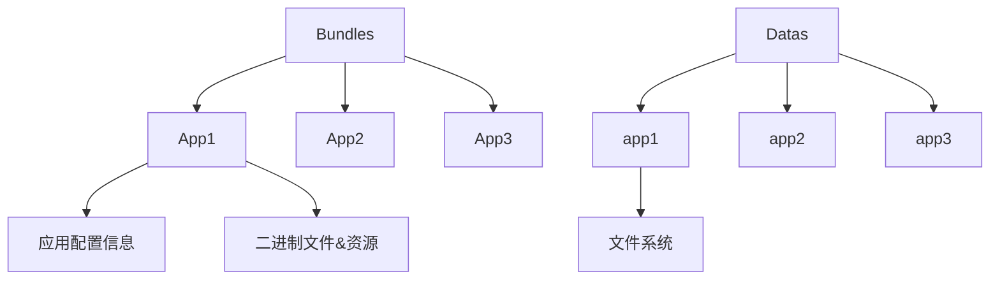
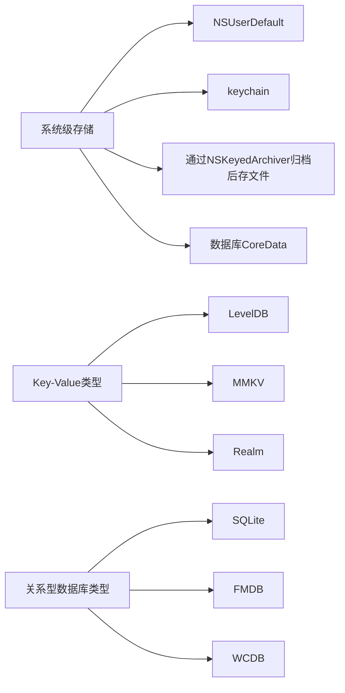
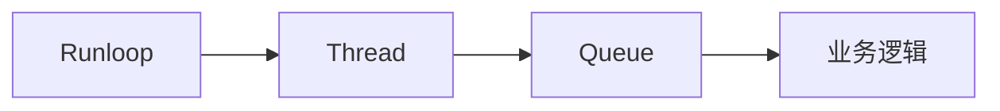
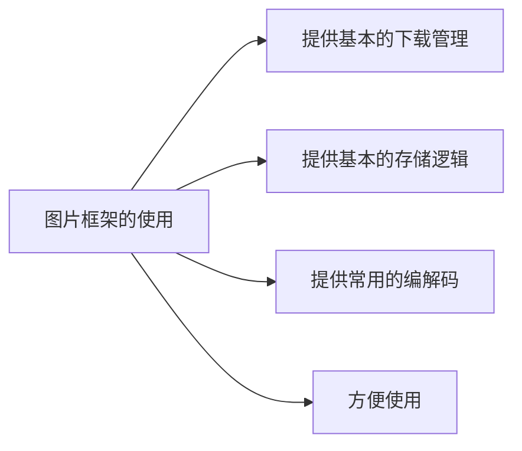
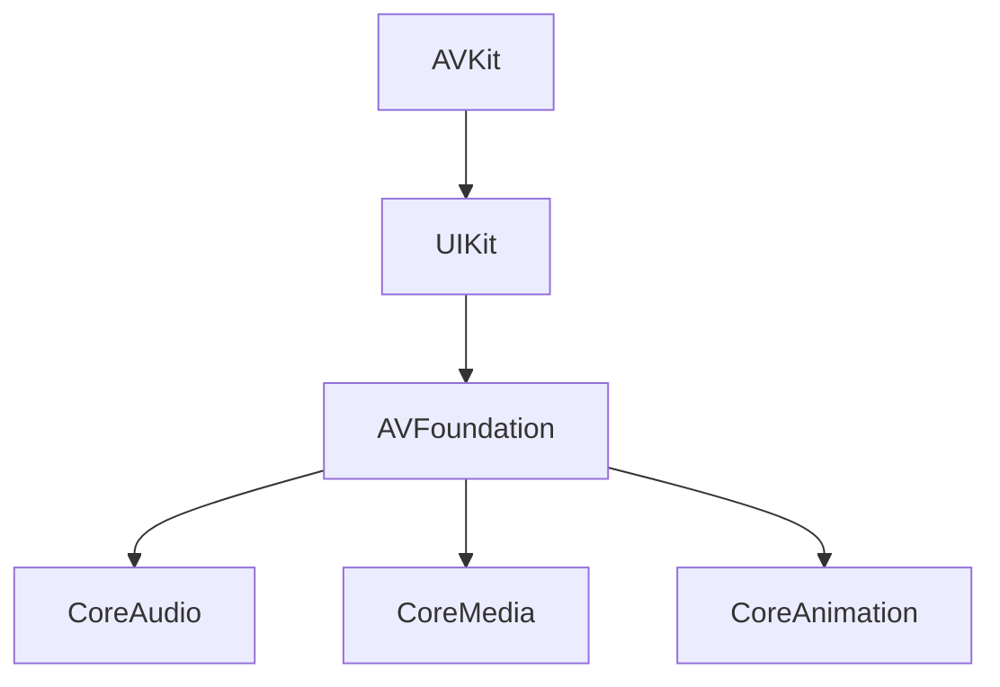
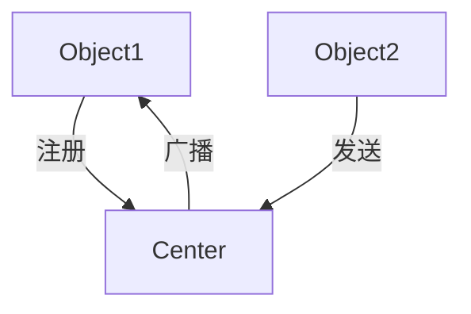

# IOS_OC编程

## UIView

>最基础的视图类，管理屏幕上一定区域的内容展示
>
>最为各种视图类型的父类，提供基础的能力
>
>外观、渲染和动画相应区域内的事件布局和管理子视图

---

### 布局

- 设置大小、位置(width height x y四个属性称为frame)
- addubView

### 使用栈管理全部的子View

- 位置重叠的展示最后入栈的
- 可以随时调整位置
- 插入到指定位置

---

### UIView的生命周期

>\- (void)willMoveToSuperview:(nullable UIView *)newSuperview;
>
>\- (void)didMoveToSuperview;
>
>\- (void)willMoveToWindow:(nullable UIWindow *)newWindow;
>
>\- (void)didMoveToWindow;

---

### UIViewController

> 视图控制器，管理视图view层级结构 相当于一个容器可以加载view
>
> - 自身包含view，可以理解为一个容器
> - 管理view视图的生命周期
> - 响应用户操作
> - 和APP整体交互
> - 作为一个container管理多个controller和动画

#### viewcontroller的生命周期

- init
- viewDidLoad
- viewWillAppear
- viewDidAppear
- viewWillDisappear
- viewDidisappear
- Dealloc

---

### 通过UIView和UIViewController的特性搭建App

- UIView负责页面内的内容呈现
- 使用基础的UIViewController 管理多个UIView
- UIViewController在管理UIView的同时，负责不同页面的切换

> UIViewController还可以管理多个UIViewController

#### 单页面展示

- 通过列表展示简介
- 通过较长滚动页面展示内容

#### 多页面管理

- 4个或5个底部按钮
- 通过Push的方式进行页面的切换

### UITabbarController

```
UItabBarController 功能就是管理多个ViewController切换，通过底部对应按钮，选中对应需要展示的ViewController
```

---

## UINavigationController

- 通过栈管理页面间的跳转
- 通常只展示栈顶页面
- Push/Pop操作

通过UINavigationController响应操作，护理UIViewController的切换

---

UIWindow

- 特殊形式的UIView，提供App中展示内容的基础窗口

- 只作为容器，和viewController一起协同工作

- 通常屏幕上只存在、展示一个UiWindow

  >使用方式
  >
  >- 使用storyborad自动创建
  >
  >- 手动创建
  >
  >  1. 创建UiWindow
  >
  >  2. 设置rootViewController
  >
  >  3. makekeyAndVisible
  >
  >     ​	

两种方式组织起Ui框架

UIWindow -> TabBarController -> NavigationController -> ViewController (apple推荐)

UiWindow -> NavigationController -> TabBarController -> ViewController (方便常用)

---

## delegate设计模式

UiTabBarController - 自动处理点击之后的页面切换

需要执行自定义操作的对象 delegate 实现协议

> 1、设置self为delegate的接受者，也就是实现方法的对象
>
> - 例子 tabBar.delegate = self
>
> 2、根据需要按需实现方法shouldSelectViewController 和 didSelectViewController

| 设计者                               | 使用者              |
| ------------------------------------ | ------------------- |
| 提供一些使用者可以自定义的操作       | 设置delegate = self |
| @optional/@required 注解             | 按需实现方法        |
| 提供 @property - delegate            |                     |
| 在对应的时机，让delegate执行对应方法 |                     |

---

## UiTableView

- tableHeaderView
- UiTableView
- tablefooterView
- UiTableViewCell

### UiTableViewDataSource

``` 
UiTableView	作为视图，只负责展示，协助管理，不管理数据，需要开发者为UitableView提供展示所需要的数据及cell通过delegate的模式，开发者需要实现UITableViewDataSource
@require
numberOfRowslnection:(NSInteger)section;
cellForRowAtIndexPath:(NSIndexPath *) indexPath;
```

### UiTableViewCell默认提供展示文字和图片

- cell.inageView
- cell.contentView
- cell.textLabel
- cell.detailTextLabel

### UItableViewCell的重用

- 系统提供复用回收池，根据reuseldentifier作为标识
- 从可视区自动回收进cell回收池，然后再从回收池复用cell 

### 标记不同的cell--通过NSIndexPath的section和row

```
NSIndexPath.section
NSIndexPath.row
```

### UITableViewDelegate

- 提供滚动过程中，UITableViewCell的出现，消失时机
- 提供UITableViewCell 的高度、headers以及footers设置
- 提供UITableViewCell各种行为的回调（点击，删除等）

### 总结

- 提供最基础的列表类型视图组件
- 提供默认基础的UITableViewCell 样式、header和footer的管理
- 提供针对UITableViewCell的复用回收逻辑
- 提供列表基础功能，如点击、删除、插入等

1. 创建UITableView 设置delegate和datasource，通过两个delegate
2. 选择实现UITableViewDataSource中方法、行数、cell复用
3. 选择实现UITableViewDelegate中的方法（高度、headerFooter、点击）

---

## UICollectionView

- 提供列表展示的容器
- 内置复用回收池
- 支持横向+纵向布局
- 更加灵活的布局方式
- 更加的装饰视图
- 布局之间的切换

> 和UITableView有相同的Api设计理念--都是基于datasource以及delegate驱动的
>
> row -> item
>
> - 由于一行可以展示多个视图
>
> UICollectionViewDataSource
>
> - numberOfItemInSection
> - cellForItemAtlndexPath
>
> UICollectionViewDelegate
>
> - willDisplayCell / endDisplayCell
> - -(void)collectionView

### UIColletionViewCell

```
不提供默认样式
	不是以‘行’为设计基础
	只有contentView/backgroundView
	继承自UICollectionReusableView
必须先注册Cell类型用于重用
	-(void)registerClass
	-(__kindof UICollectionViewCell *)dequeueReusableCellWithReuseIdentifier
```


### UICollectionViewLayout

>  用于生成UICollectionView布局信息的抽象类
>
> - UiCollectionView 提供基本的容器、滚动、复用功能
> - 布局信息完全交给开发者
> - 作为抽象类，业务逻辑需要继承
> - 实现UICollectionViewLayoout(UISubclassingHooks)中的方法
> - 系统提供默认的流式布局Layout

### UICollectionViewFlowLayout

```
流式布局，每行排满后自动换行
minimumInteritemSpacing用来计算一行可以布局多少个item
实际的大小在布局后重设
设置的是minimun值
```

- UICollectionViewDelegateFlowLayout 根据indexPath做更细化的自定义样式

### 总结

- 提供灵活的 可定制的列表类型视图组件
- 提供默认基础的Flow样式布局
- 提供针对UICollectionView的复用回收逻辑
- 提供列表其他功能，如点击、删除、插入以及布局的切换等

> 1. 创建UICollectionViewLayout，使用系统默认流式布局，或自定义布局
> 2. 创建UICollectionView，设置delegate和datasource，注册cell类型
> 3. 选择实现UICollectionViewDataSource中的方法，行数、cell复用
> 4. 选择实现UICollectionViewDelegate中的方法（点击、滚动）

----

## UIScrollView

tableView和collectionView都是继承于此

> - contentOffset: 滚动区域左上角与视图左上角的距离
>
> - frame 视图在屏幕中展示的大小
> - contentSize 视图内部，内容可以滚动的区域
>
> 其他常用属性和方法
>
> - scrollEnabled
> - pagingEnabled
> - showHorizontalScollIndicator
> - showVerticalScrollIndicator
> - setContentOffset:animated

### UIScrollViewDelegate

```objective-c
- (void)scrollViewDidScroll:(UIScrollView *)scrollView
滚动、监听页面滚动、以及根据offset做业务逻辑

- (void)scrollViewWillBeginDragging:(UIScrollView *)scrollView
- (void)scrollViewDidEndDragging:(UIScrollView *)scrollView willDecelerate:(BOOL)decelerate
拖拽 中断一些业务逻辑，如视频/gif播放

- (void)scrollViewWillBeginDecelerating:(UIScrollView *)scrollView
- (void)scrollViewDidEndDecelerating:(UIScrollView *)scrollView
减速 页面停止时开始逻辑，如视频自动播放

```

应用场景：

- 滚动展示
- 图片zoom

| UIKit中的滚动视图逻辑 |
| ---- |
| UIView -> UIScrollView    -> UITableView & UICollectionView |
| UISCrollViewDelegate -> UITableViewDelegate & UICollectionViewDelegate |

---

## UILabel

```
展示一行或多行文字的视图
text : @""
font: UIFont
textColr : 文字颜色
textAlignment ： 对齐方式（居中、左对齐、右对齐）
```

> numberOfLines：最大的展示行数
>
> lineBreakMode 文字截断
>
> -(void) sizeTofit
>
> 1. 固定大小的，通过展示行数截断
> 2. 可变大小使用sizeToFit确定大小
> 3. 从固定方向顺序逐一布局

---

## UIImage

```
使用场景
通过UIImageView视图展示
系统封装视图的图片展示
在上下文中绘制
```

> 展示一张静态图片
>
> UIImageView.image = UIImage
>
> 展示一组静态图片，成为动图
>
> 1. UIImageView.animationImages = @[UIImage,UIImage..]
> 2. UIImageView.animationDuration = 1
> 3. [UIImageView startAnimating]

### UIViewContentMode

当图片尺寸和UIImageView尺寸不符时，自定义填充方式

---

## UIButton

> 可以展示文字、图片 不止有静态的展示功能，同时增加了用户交互

 

| 可交互的视图 -> 展示 文字、图片                            |      |
| ---------------------------------------------------------- | ---- |
| **->** **交互 响应用户的点击、拖拽等开发者自定义业务逻辑** |      |

展示上的UIButton

- 默认的UIButton提供ImageView和titlelabel的基本布局
- 通过设置enabled/selected/highlighted改变基本状态
- 在每种状态下都有对应的视图
- 可以忽略默认视图，直接自定义subView

``` 
button.imageView
button.titleLabel
```

### Target-Action

- 当某个事件触发时，调用对应的target对象的相应方法
- 传值的限制比较多

UIButton的addTarget方法的实现就是采取了target-action的设计模式 

- UIButton通过target-action的模式，处理点击逻辑
- 系统封装用户操作事件
- 对应事件开发者实现自定义的方法

### UIControl

- UIControl作为父类，集成了所有子类可能用到的事件
- 系统级封装的可交互视图，都继承自UIControl

---

## UIGestureRecognizer

识别用户在屏幕中的触摸

> 可以在任何视图上，增加一个或者多个手势，系统自动识别手势，开发者自定义响应逻辑
>
> 采用Target-Action的方式进行处理

1. 创建手机
2. 设置响应处理
3. 在视图中添加

一些非UIControl的组件，就可以通过UIGestureRecognizer进行手势的操作

### UIGestureRecognizerDelegate

可以实现一些更复杂的手势操作

手势的不同阶段：UIGestureRecognizerState

> 通过Delegate的方式
>
> 拓展在手势识别过程中的自定义操作
>
> - 是否响应手势
> - 是否支持多手势
> - 多个手势冲突时如何冲突处理

作为UIControl的补充，可以在任何View上进行手势操作逻辑实现

---

## UIAlertView

UIAlertView is deprecated

> 通过UIView/UILabel/UIButton可以组装成任何复杂的支持交互的视图组件
>
> 组件内封装基本逻辑
>
> 开发者提供需要展示的数据
>
> 将基本逻辑中的可定制业务，封装Delegate

1. 组件内封装基本逻辑

- 创建view、label、button以及分割线
- 设置基本的样式、字体大小等
- 内置Button点击手势，取消隐藏

2. 开发者提供需要展示的数据
   - 主标题文字、副标题文字
   - 按钮文字
3. 将基本逻辑中的可定制业务，封装Delegate
   - 点击按钮之后的业务逻辑
   - 展示AlertView前后的处理逻辑

---

## UIKit使用

以上就是UIKit的最基本内容，还有很多内容，看文档

UIKit：

- 提供构建APP最核心的模块

  主要处理提供石头鱼展示内容，以及和用户的交互

- 基于MVC的设计模式

  系统封装视图和逻辑，开发者提供数据驱动

- 交互

  通过Delegate方式或者Target-Action方式

---

## Web基础知识

### UIWebView （ios2.0-12）

> 内存系提性泄露
>
> 系统OOM多
>
> 稳定性差
>
> WebCore和JSCore Crash较多
>
> 对H5和CSS3支持较少

### WKWebView

> 独立进程，内存
>
> Crash不影响主APP
>
> 对HTML和CSS更好的支持
>
> 更多更友好的系统函数
>
> 采用JIT技术

### WKWebView的基本使用

- 基于WebKit框架

- 基本的加载

  通过configuration进行基本设置

  加载URL & HTML

  类比之前的UIKit提供的基本功能，在delegate中处理业务逻辑

  - configuration

    基本的共享Cookie设置

    基础偏好设置

    播放视频设置

    默认JS注入

### WKWebView Delegates

| WKNavigationDelegate                                         | WKUIDelagate                          |
| ------------------------------------------------------------ | ------------------------------------- |
| decidePolicyForNavigationAction  是否加载请求（scheme拦截、特殊逻辑、js和native通信） | runJavaScriptAlertPanelWithMessage    |
| didFinishNavigation webView加载失败（loadVIew展示，重试按钮等） | runJavaScriptConfirmPanelWithMessage  |
| didFailNavigation webView加载失败（loadview展示，重试按钮等） | runJavaScriptTextInputPanelWithPrompt |
| webViewWebContentProcessDidTerminate webView Crash回调（自动重新加载） | 处理alert/confirm/prompt()自定义样式  |

### 使用WKWebView流程

1. 创建WKWebView
2. 设置Delegate以及样式、JS注入等
3. 加载URL或HTML字符串
4. 在相应的回调中处理业务逻辑

---

## 观察者模式

- 定义了一种一对多的关系，可以让多个观察者同时监听某一个对象或对象的属性变化
- 被监听的对象在状态变化时，会通知所有的观察者，使他们能够及时的处理业务逻辑
- 和代理delegate模式的对比

观察者们 --注册--> 被观察者

被观察者 --广播--> 观察者

### KVO（NSKeyValueObserving）

-  注册监听
  - self作为监听者
  - 监听self.webView的estimatedProgress属性
  - 在NSKeyValueObservingOptionNew的时候发通知
- 接收监听
  - change对应着上面的options
- 移除监听

使用kvo进行页面监听

### 系统KVO的问题

- 需要移除Crash风险
- 复杂的方法名&参数

常用开源KVO

需要移除Crash风险

复杂的方法名 & 参数 Block处理回调 

KVOController

---

## iOS中的Web应用

>  和浏览器不同，在展示的同时，所以需要和Native进行交互

- Javascript native通信
- 跨平台 & 热修复
- 业务逻辑

---

## IOS中的动画

core Animation -> UIView动画  & UKit组件自带动画

### UIView动画

```
UIView内置动画封装(UIViewAnimationWithBlocks)
```

- 解决日常开发80%以上的动画效果
- 处理基本的frame、Alpha、Transform
- 不能自定义中间过程

> 实现只需要两步
>
> 1. 设置动画参数（时间、效果）
> 2. 动画终止时属性的最终值

---

## CALayer

- 每个UIView都有一个CALayer负责内容的绘制与动画
- UIKit其他组件对应的展示Layer(CAScrollLayer. CATextLayer)
- 和UIVIew相同的结构(subLayer)

UIResponder --CALayer--> UIView

处理事件的Object，包含绘制内容

- 使用UIView的CALayer实现圆角
  - 全部系统UI组件都可以取道对应的CALayer
- 创建自定义CALayer
  - 轻量、无需交互的单纯展示
  - 不易debug
  - UIView默认情况下禁止了CALayer的动画

---

## CoreAnimation

- CABaseAnimation

  基本动画、时常、开始结束状态等

- CAKeyframeAnimation

  关键路径动画，设置不同的时间点

- CAAnimationGroup

  复杂动画都可以分解成多个简单动画

- CATransition

  转场动画（渐入渐出）- UIViewController

### 开发中的动画使用

- 粒子发射器 CAEmitterLayer
- 动画效果的封装
  - 切换/组件/加载
- 动画的实现
  - Lottie
  - facebook/pop

---

## App内基本网络流程

- NSURL
- NSURLRequest
- NSURLSession

### NSURLSession

- 负责接收、发生和处理请求
- 一个Session可以创建多个请求
- App可以创建不同配置的多个session
- 封装Request为Task，控制状态、开始取消、进度

> 1. 创建NSURLSession会话
> 2. 配置会话NSURLSessionConfiguration
>    - timeout时间
>    - cookie缓存策略
>    - 最大并发数、是否支持蜂窝数据
>    - 其他网络行为的行为和策略
>    - 根据Configuration的不同，提供默认、后台、以及自定义
> 3. 创建NSURLSessionTask
>
> - 四种Task的区别
>
>   datatask：处理简单的数据流 如Json数据
>
>   downloadTask: 大数据下载，断点续传和进度等
>
>   uoloadTask：上传数据
>
>   streamTask：流数据

#### NSURLSessionTask

NSURLSessionTask的状态

创建好的sessiontask是suspend状态，调用resume开始执行

#### 处理Response

- 通过handler block
- 通过delegate

#### 系统框架加载数据

IOS9新增ATS特性，默认要求都是用https进行请求

系统NSURLSession加载数据流程

1. 创建 & 使用默认Session
2. 通过地址和参数创建Task
3. 开始 & 取消 Task
4. 在handler中处理数据

---

## 依赖管理

| subModule                          | CocoaPods                 | Carthage                         |
| ---------------------------------- | ------------------------- | -------------------------------- |
| 基于git                            | ruby语言安装和使用        | swift语言安装和使用              |
| 使用简单 功能较少 只能下载全部项目 | 中心化的管理生成workplace | 去中心化的管理 提供framework文件 |
| debug方便                          | debug方便                 | debug不便                        |

### 开源网络框架的使用

使用AFNetWorking加载网络数据

---

## iOS中的json解析

NSJSONSerialization：提供json数据和系统对象之间的转换

- dataWithJSONObject
- JSONObjectWithData

Option 

- NS_OPTIONS

完整列表加载流程

- 通过网络接口加载数据
- 使用NSJsonSerialization解析处理网络请求
- 数据model化
- 列表加载model数组

---

## iOS文件管理

### 沙盒



### iOS沙盒文件结构

- 沙盒机制 只能访问程序自己的目录，每个App特有的文件夹

  - Document

    可以进行备份和恢复，体积较大，一般存档用户数据

    支持用户共享

  - Library

    开发者最长使用的文件夹，，可以自定义子文件夹

    - Preference

      用户偏好设置mNSUserDefault，支持备份

    - Cache

      不需要缓存，体积较大，一般的删除缓存操作

    - 自定义文件夹

  - tmp

    临时文件不会备份，启动时有可能被清除

### iOS获取沙盒地址

- NSPathUtilities

### NSFileManager

- 单例，提供App内文件和文件夹管理功能
- 创建文件、删除文件、查询文件、移动和复制等
- 读取文件内容和属性
- 通过NSUrl或者NSString作为path

### NSFIleManagerDelegate

- 提供移动、复制、删除等操作的具体自定义实现

### NSFileHandle

- 读取文件 & 写文件]
- 读取指定的长度 & 在指定位置追加/截断
- 截断 & 立即刷新
- 常用于追加数据

### NSCoder

- 归档（序列化）& 解归档（反序列化）
- 通过简单的函数，在Object和二进制数据间进行转换
- 抽象类 具体给功能需要子类实现

为了向前向后兼容，不依赖顺序，所以需要将非基本数据对应到key存储

#### NSKeyedArchiver

- NScoder的子类
- 提供简单的函数，在Object和二进制数据间进行转换
- 提供基本的delegate
- 需要object自己处理的key-value对应关系

### NSCoding[48节要重新看]

对于object的序列号&反序列化协议

- NSArray & NSDictionary等类型系统已经实现协议

- NSSecureCoding

  解决文件替换攻击

  序列化时规定Class 

  

---

### NSUserDefault

- 提供简单的key-value存储

## 开源存储框架对比



---

## 缓存新闻

- 使用NSKeyedArchiver 保存列表数据

  ``` mermaid
  graph LR
  	加载本地数据 --> 网络请求成功后替换
  ```

- 使用NSUserDefault保存已读状态

  已读过的新闻，列表显示不同颜色

- 实际项目中的使用

  结合项目有结构，选择存储方式

  数据库/KV/系统级

### 优化网络和存储流程

- 实际项目中，阅读记录不建议存储在NSUserDefault中
- 网络和存储的结合
  - 使用缓存数据防止重复请求
  - 使用缓存数据占位优化体验

---

## iOS中的多线程基础

### iOS中的进程 & 线程

- 通常来说一个App就是一个进程
- iOS开发中较少的运用进程间的通信（XPC）, 绝大部分都使用线程

### iOS中的主线程 / 非主线程

- 保证流畅体验及线程安全，所有UI操作都集中到一个线程
- 影响UI体验（较长时间的操作）尽量放到非主线程
- 同步&异步

### iOS中的多线程相关的知识点

- NSThread/GCD/NSOperation/Runloop。。。

### NSThread

iOS中的线程

- pthread的封装
- 创建新的线程
- 执行之后自动销毁
- 每次都要创建
- 手动进行线程同步
- 手动管理线程的生命周期

### GCD Grand Gentral Dispatch

- 高性能的多线程解决方案，自动利用CPU
- 线程池模式，自动分配/调度线程，管理线程的生命周期
- 通过队列管理多任务，FIFO
- 对开发者使用队列代替线程的创建（加入到合适的线程 --> 加入到合适的队列）

#### GCD中的队列

- 主线程对应的队列
- 非主线程按照优先级分为4个队列
  - High/Default/Low/Background
- 自定义队列
  - DISPATCH_QUEUE_SERIAL(串行)
  - DISPATCH_QUEUE_CONCURRENT（并发）

#### GCD的使用

- 使用GCD处理多线程业务逻辑
- 选择合适的队列，添加业务逻辑block
- 在队列中同步/异步/延迟执行业务逻辑
- 注意循环使用

### NSOperation

- GCD缺少可定制性和复杂的依赖
- 面向对象的封装NSOperation
  - 提供任务之间的依赖关系
  - 支持取消暂停任务，优先级的设置
  - 子类继承实现，符合业务逻辑的定制
  - 队列支持最大并发数设置等等
- NSOpeationQueue（GCD中的队列）
- NSOperation（GCD Block中的任务）

### Runloop

- Runloop伴随线程的任务处理循环
- Runloop和线程一一对应
- Mode & 状态监听
- Runloop的应用
  - NSTimer
  - performselector



---

## 图片的下载与存储

> - 使用异步的请求加载 & 缓存
>   - 多个请求的管理/优先级/状态异步
>   - 磁盘与缓存之间的权衡



- 使用SDWebImage加载图片
  - 使用CocoaPod集成
  - 加载列表图片
- 其他图片开源框架
  - FastImageCache
  - LKImageKit

### APP中的图片加载

对于图片库的修改 & 二次封装

- 结合App内的通用请求
- 特殊的编解码
- 大量图片同时渲染
- 特殊的裁剪
- Cache策略 & 用户隔离
- 本地图片的加载和使用

---

## IOS中的音视频框架

- AVKit
  - AVPlayerViewController
  - 较高级的接口
  - 创建全部视图层服务，用户控制、导航等
- AVFoundation
  - AVPlayer/AVAsset
  - 基于时间的音视频播放框架
  - 数据和播放状态管理。较少的UI
- MPMoviPlayerController



### 使用AvPlayer播放视频

1. 根据资源地址URL，创建AVPlayerItem
2. 根据AVPlayerItem创建播放器
3. 根据播放器中的Layer，粘贴到自己想要的位置
4. 播放以及基本的开始 & 暂停

#### AVPlayer播放状态

- 监听AVPlayerItem获取加载和播放状态
- 监听系统Notification播放状态

#### AVPlayer播放进度

- CMTime
- CMTimeMake（第几帧 帧率）
- duration/currentTime
- 播放进度回调

---

## NSNotification

类与类之间的通信（系统调用/解耦）

| delegate                                                     | KVO                                                          | notification                                                 |
| ------------------------------------------------------------ | ------------------------------------------------------------ | ------------------------------------------------------------ |
| 一对一   <br /><br />可以有返回值<br />互相的引用关系<br />协同工作 处理业务逻辑 | 一对多<br />只能作用在value以及变化上<br />需要互相依赖<br />单方向无协同 | 一对多<br />能携带更多的信息<br />常用于系统级消息<br />无依赖<br />单方向无协同 |

### NSNotification的设计

- NSNotificationCenter
- 中心化的管理
- 主要关注系统性事件 而不是特有对象的事件
- 前后台切换 内存警告



```objective-c
notification 内部销毁时 要从这个单例中移除
- (void)dealloc{
  [[NSNotificationCenter defaultCenter] removeObserver:self];
}
```


